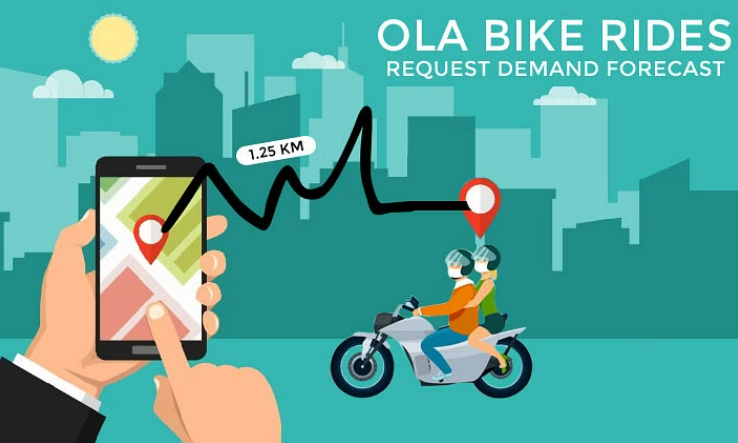
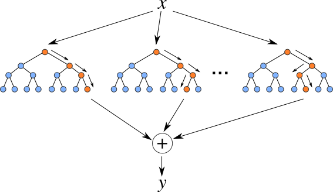

# TaxiRequest_ML_Forecaster

Inspired by Ola Bike Rides Request Demand Forecast through big data in the taxi service (ride-hailing) sector, specifically OLA, this project utilizes multi-step time series forecasting and clustering with the Mini-Batch K-means Algorithm on geospatial data. The aim is to predict future ride requests for a particular region at a given time.

## Background - Ola Bike Ride Request Demand Forecast Project Description

The ride-hailing industry has witnessed rapid growth, with taxi drivers facing the challenge of selecting strategic waiting locations to efficiently cater to passenger requests. Passengers, on the other hand, seek prompt taxi services. The occurrence of unfulfilled booking requests or prolonged wait times due to a lack of nearby taxis has been a common issue. Predicting taxi demand has become crucial for ride-hailing companies to optimize fleet management and meet customer expectations.

## Ola Bike Ride Demand Prediction ML Project - Business Problem

Machine learning-based bike ride request demand forecasting plays a vital role in optimizing resource allocation, enhancing operational efficiency, and ensuring customer satisfaction. Accurately predicting the number of people seeking bike rides at different times and locations allows businesses to deploy sufficient bikes and riders when and where needed. This, in turn, enables companies to maximize resources, reduce costs, and offer high-quality service. Ola Bikes, however, faces losses and increased competition due to unmet ride requests. To address this, the project focuses on predicting ride demand within the Ola app for a specific town/region and future time window, utilizing a model based on user ride request data.

## Aim Of The Ola Bike Ride Prediction Project In Machine Learning

The goal of this ML mini project is to develop a model for predicting ride requests (demand forecast) in a particular town, latitude, and longitude for a requested future time window/duration.

## Solution Approach For The Ola Bike Ride Request Demand Prediction Project

The project involves several steps in its approach:

### Ola Bike Rides Demand Prediction ML Project - Data Description

Utilizing the raw_ride_request Ola dataset, the project works with key data points such as unique user identifiers, ride request date and time (in IST), and latitude-longitude coordinates for pickup and drop-off locations across India.

The data fields in the raw Ola dataset include:

- number: unique user ID
- ts: DateTime of booking ride (IST time)
- pick_lat: ride request pickup latitude
- pick_lng: ride request pickup longitude
- drop_lat: ride request drop latitude
- drop_lng: ride request drop longitude

## Data Exploration, Analysis, And Cleaning

The initial step involves loading the raw dataset (raw_data.csv), determining the total number of rows (83,81,556), removing duplicates (1,13,540 duplicate entries), and handling null values. The remaining dataset features are analyzed, and advanced data cleaning techniques are applied, including identifying multiple bookings by the same user within a certain timeframe and geospatial feature engineering.

### Data Preparation (Geospatial Feature Engineering)

Following data cleaning, geospatial feature engineering is performed, including the application of the Mini-batch K-Means clustering algorithm on pickup latitude and longitude to determine demand regions. Additionally, time features are broken down into hour, minute, day, week, etc. Advanced data analysis is conducted to identify correlations between ride requests using a HeatMap.

### Defining A Good Ride Request

The project solution also involves determining the good and bad ride requests from the given dataset. Below are some of the guidelines followed in the project solution code while defining a good ride request :

- Count only 1 ride request by a user if there are multiple bookings for any destination from the exact latitude and longitude within 1hour of the last booking time.

- If there are ride requests within 8mins of the last booking time, consider only 1 ride request from a user (latitude and longitude may or may not be the same).

- If the geodesic distance from the pickup and drop point is less than 50 meters, consider that ride request a fraud ride request.

- Consider all ride requests where pick up or drop point is outside India bounding box: ["6.2325274", "35.6745457", "68.1113787", "97.395561"] as a system error.

- Karnataka is the prime city being focused upon in the given data, which has a lot of drivers and ride requests to fulfill. The ride-sharing services cannot serve     rides outside Karnataka and have pickup and drop distances> 500 km. Karnataka bounding box: ["11.5945587", "18.4767308", "74.0543908", "78.588083"]

## Ola Bike Ride Demand Forecasting Project - Model Building

The project employs various machine learning algorithms/models, such as Linear Regression, Random Forest, and XGBoost, along with metrics like Root Mean Square to evaluate model performance.

### Linear Regression

The Linear Regressor model is explored, highlighting its tendency to underfit the training dataset and perform inadequately in non-linear data scenarios.

### Random Forest

The Random Forest model is analyzed, revealing its tendency to overfit on the training dataset and its limitations for the specific dataset, as indicated by RMSE values for training and testing datasets.

### XGBoost

The XGBoost model is applied, showcasing its effectiveness for non-linear datasets compared to other models. The importance of clusters, illustrated through feature importance graphs, is discussed.

### Model Prediction Pipeline

After model development, a prediction pipeline is built to deploy the model. Testing is conducted using clean data (filtered ride requests data based on good ride definition conditions) for a specific date, with the goal of predicting initial hours' ride request demand forecast for the following day.

## Bike Ride Demand Forecasting - Use Cases

Key use cases for bike ride request demand predictions are identified across different industries, including:

- Ride-Sharing Companies
- Food Delivery Services
- Logistics And Delivery Companies
- Tourism Services

## Bike Ride Demand Forecasting - Real-World Examples

Real-world examples of bike ride service providers leveraging data science and machine learning for demand forecasting are explored:

- Ola
- Lime
- Uber
- Deliveroo
- Grab